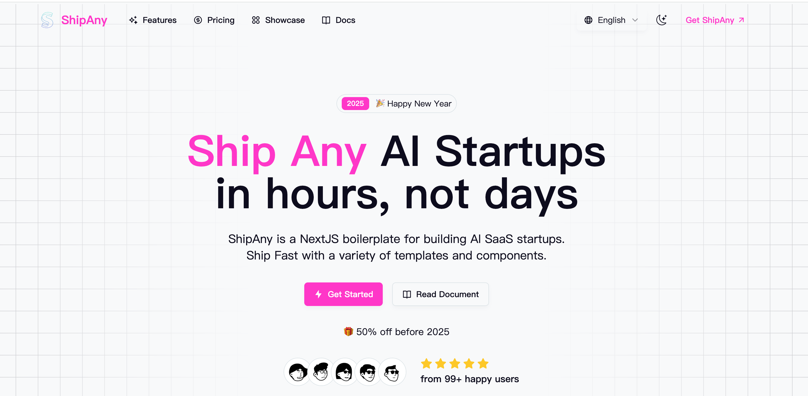

# ShipAny Template One

Ship Any AI SaaS Startups in hours.



## 快速上手视频教程

### 第一集：使用 ShipAny 一小时上站

[https://www.bilibili.com/video/BV1ooK7eJEag](https://www.bilibili.com/video/BV1ooK7eJEag)

### 第二集：对接 AI 接口，实现壁纸生成，完成业务功能开发

[https://www.bilibili.com/video/BV1v1KnesEbg](https://www.bilibili.com/video/BV1v1KnesEbg)

### 第三集：对接支付系统，核销用户积分，实现壁纸管理后台

[https://www.bilibili.com/video/BV1VUKnepEoY](https://www.bilibili.com/video/BV1VUKnepEoY)

## Quick Start

1. Clone the repository

```bash
git clone https://github.com/boomer1678/shipany-template.git
```

2. Install dependencies

```bash
pnpm install
```

3. Run the development server

```bash
pnpm dev
```

## Customize

- Set your environment variables

```bash
cp .env.example .env.development
```

- Set your theme in `src/app/theme.css`

[tweakcn](https://tweakcn.com/editor/theme)

- Set your landing page content in `src/i18n/pages/landing`

- Set your i18n messages in `src/i18n/messages`

## Deploy

- Deploy to Vercel

## Community

- [ShipAny](https://shipany.ai)
- [Documentation](https://docs.shipany.ai)

## License

- [ShipAny AI SaaS Boilerplate License Agreement](LICENSE)
